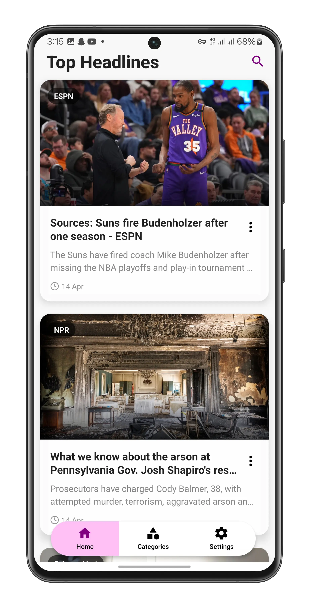
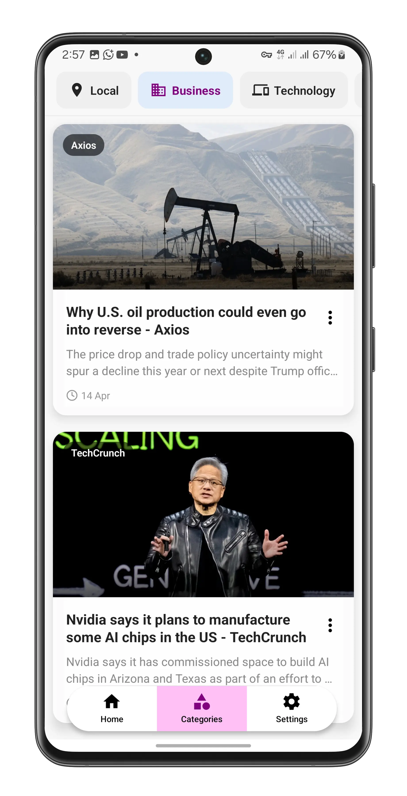
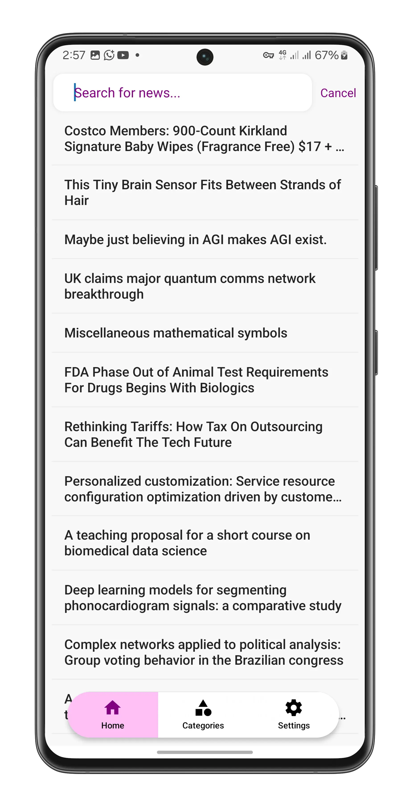
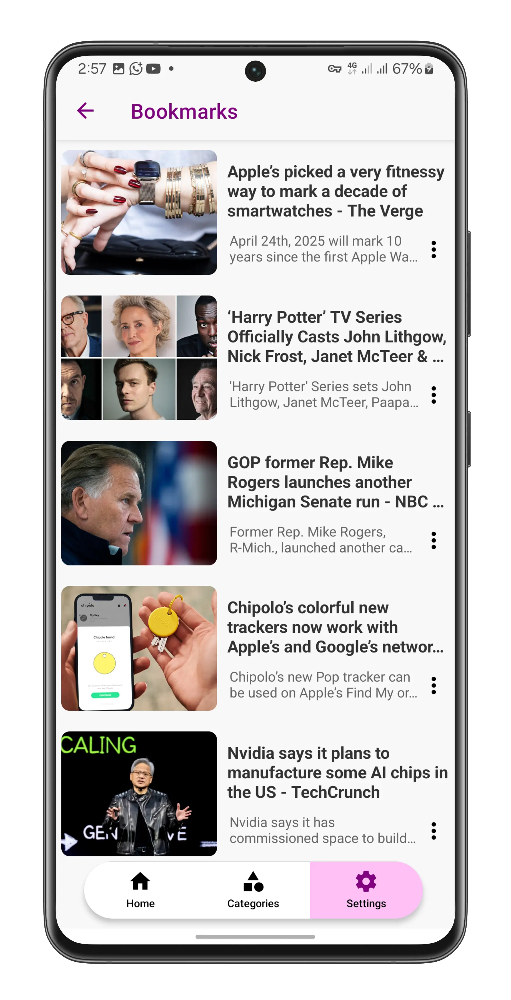
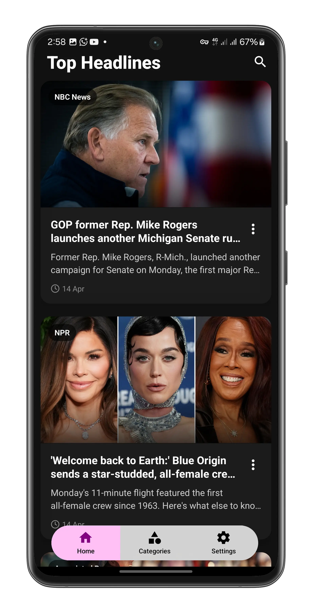

<div align="center">

 

# World Brief

World Brief is a mobile news app that provides users with curated news articles across various categories, featuring dark mode support and bookmarking functionality.

</div>

## Screenshots

<div align="center" style="display: flex; flex-wrap: wrap; justify-content: center; gap: 1px;">
    
    
    
    
    
    
</div>

## Features

- Multiple News Categories

  - Local
  - Business
  - Technology
  - Sports
  - Entertainment
  - Health
  - Science

- Dark/Light Mode Toggle
- Bookmark Articles
- Search Functionality
- Caching Mechanism for Improved Performance

## Installation

1. Clone the repository

```bash
git clone https://github.com/aubynsamuel/world-brief.git
cd world-brief
```

2. Install dependencies

```bash
npm install
# or
yarn install
```

3. Configure API Keys

- Create `apiKeys.tsx` in the root directory add your NewsAPI keys

```
export const API_KEYS: string[] = [
  "examplekey1",
  "examplekey2",
  "examplekey3",
];

```

4. Run the application

```bash
# Start the app
npx expo start
```

## Contributing

1. Fork the repository
2. Create your feature branch (`git checkout -b feature/AmazingFeature`)
3. Commit your changes (`git commit -m 'Add some AmazingFeature'`)
4. Push to the branch (`git push origin feature/AmazingFeature`)
5. Open a Pull Request
