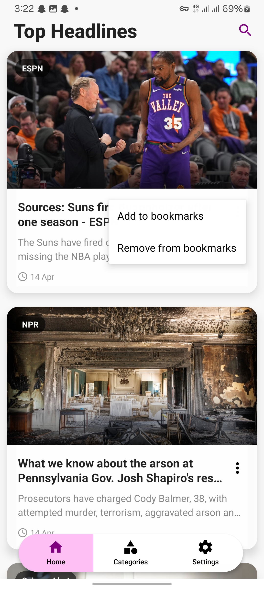
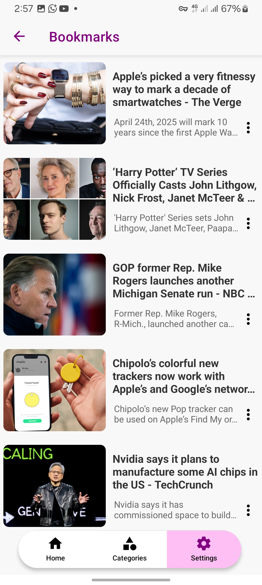
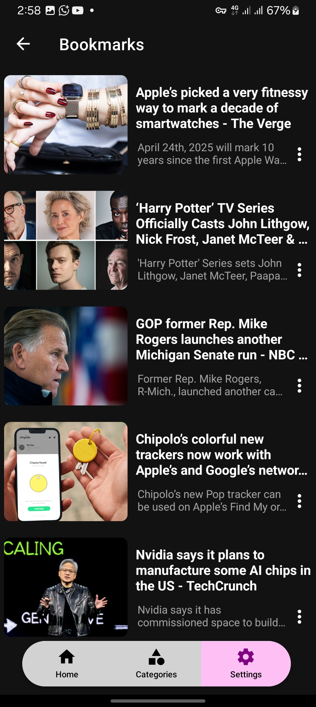
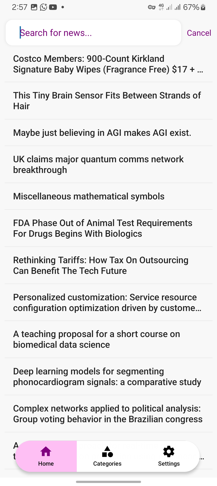
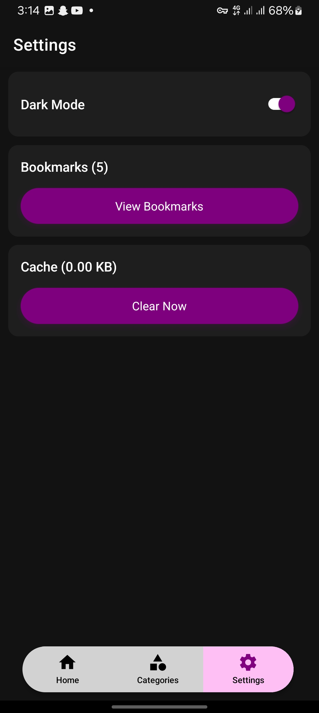

# World Brief: React Native News Application

## Overview

World Brief is a mobile news application built with React Native that provides users with curated news articles across various categories, featuring dark mode support and bookmarking functionality.

## Screenshots

<div style="display: flex; flex-wrap: wrap; justify-content: center; gap: 45px;">
    
    
    
    
    
    
    
    
</div>

## Features

- Multiple News Categories

  - Local
  - Business
  - Technology
  - Sports
  - Entertainment
  - Health
  - Science

- Dark/Light Mode Toggle
- Bookmark Articles
- Search Functionality
- Caching Mechanism for Improved Performance

## Prerequisites

- Node.js (v18+)
- Latest version of the expo go app

## Installation

1. Clone the repository

```bash
git clone https://github.com/aubynsamuel/world-brief.git
cd world-brief
```

2. Install dependencies

```bash
npm install
# or
yarn install
```

3. Configure API Keys

- Add your NewsAPI keys in `apiKeys.tsx`

4. Run the application

```bash
# Start the app
npx expo start
```

## Project Structure

- `/app`: Application routes with expo router
- `/components`: Reusable UI components
- `/constants`
- `/context`: App state management
- `/services`: API interaction logic
- `/types`: Typescript type definitions
- `/apiKeys.ts`:News API keys
- `/package.json`

## Contributing

1. Fork the repository
2. Create your feature branch (`git checkout -b feature/AmazingFeature`)
3. Commit your changes (`git commit -m 'Add some AmazingFeature'`)
4. Push to the branch (`git push origin feature/AmazingFeature`)
5. Open a Pull Request
